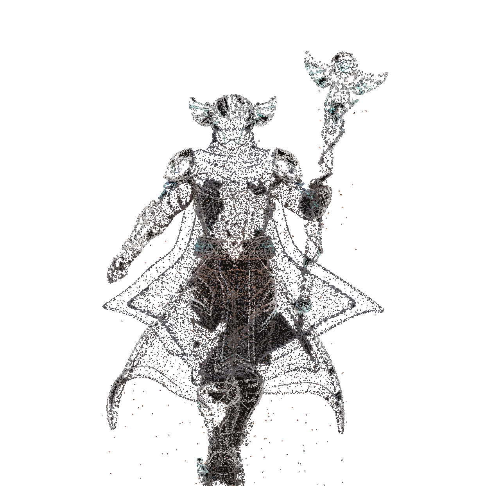

<p align="center">
  
</p>

# Archie Gateway Guardian for Tab5

An open-source-ready AI control surface for the **M5Stack Tab5**. A full-screen
Nexus portal brings the device online, first-time setup happens entirely on the
device, which turns it into your own command
console for Hermes, OpenClaw, OpenAI, Claude, or another OpenAI-compatible API.

No Wi-Fi password, API key, gateway token, device address, or local file path
is compiled into this repository. Operators enter credentials at first boot;
the firmware stores them only in the Tab5's NVS flash and masks them in the UI.

> **Hardware support:** verified on M5Stack Tab5 with the **ILI9881C display +
> GT911 touch controller**. ST7123 and ST7121 variants are detected by the BSP
> but remain unverified.

## What it does

- **Full-screen Nexus boot** — an optimized native-LVGL space field, shooting
  stars, dimensional orbit rings, a pulsing core, and four staged system locks.
- **Five-step first-run portal** — Wi-Fi → Link → Credentials → Voice → Test.
- **Five connection modes** — Hermes gateway, OpenClaw gateway, OpenAI,
  Claude, or a custom OpenAI-compatible endpoint.
- **Optional voice** — ElevenLabs replies play as 24 kHz PCM through the Tab5
  speaker; voice remains off until a key and voice ID are supplied.
- **Archie Command Centre** — the Tab5's main workspace for chatting with your
  selected gateway or model, watching live link telemetry, switching personas,
  and launching quick actions. Archie appears as a lightweight particle
  guardian rendered directly by the firmware.
- **Re-onboarding at any time** — open `SET` → `SETUP WIZARD`.
- **Browser provisioning** — Web Serial flashing plus Improv Wi-Fi support.
- **No secret-bearing defaults** — examples contain placeholders only; local
  `.env` files, certificates, SDK output, and device profiles are ignored.

## The easiest onboarding paths

| Goal | Recommended connection | What the operator enters |
|---|---|---|
| Full local agent and tools | **Hermes gateway** | WebSocket URL + shared device token |
| Existing OpenClaw installation | **OpenClaw** | `http://HOST:18789/v1` + gateway token |
| Fastest model-only setup | **OpenAI** or **Claude** | API key; endpoint/model are prefilled |
| Another hosted/local model | **Custom** | OpenAI-compatible base URL, key, model |

The direct OpenAI/Claude modes are deliberately text-first. Agent tools,
approvals, durable memory, and local integrations belong behind Hermes or
OpenClaw. See [the onboarding research](docs/ONBOARDING_RESEARCH.md) for the
reasoning and security tradeoffs.

## First boot

```text
POWER
  │
  ├─ full-screen NVS NEXUS bootstrap
  │
  └─ WIFI → LINK → CREDENTIALS → VOICE → TEST
                                           │
                         all checks pass ──┴─► Archie condenses in the console
```

All setup fields are editable with touch and the on-screen keyboard. A physical
keyboard can use `Tab`, `Enter`, and `Esc`. The final test makes one small live
request for direct providers, so a successful result proves the key, endpoint,
model, DNS, and TLS path together.

## Quickstart

The full walkthrough is in [docs/QUICKSTART.md](docs/QUICKSTART.md). The
[M5Stack developer resource map](docs/M5STACK_DEVELOPER_RESOURCES.md) explains
the supported flash, recovery, hardware-reference, and future publishing paths.
The visual flow and privacy-safe screenshot checklist are in
[docs/WALKTHROUGH.md](docs/WALKTHROUGH.md).

Build from source with Espressif **ESP-IDF 5.4.2**:

```bash
cd firmware
idf.py set-target esp32p4
idf.py reconfigure
python3 scripts/patch_usb_component.py
idf.py build
idf.py flash monitor
```

Or flash the merged release image at offset `0x0`:

```bash
esptool.py --chip esp32p4 -b 460800 write_flash 0x0 \
  archie-gateway-guardian-tab5-merged.bin
```

To wipe all locally stored credentials before transferring a device:

```bash
esptool.py --chip esp32p4 erase_flash
```

## Connection notes

### Hermes

The included Python and Node reference adapters speak the small streamed
WebSocket protocol described in [docs/GATEWAY_API.md](docs/GATEWAY_API.md).

```bash
cd gateway
./quickstart.sh
```

It generates a local `.env` and a device token outside version control. With
no model key it runs a demo echo, so the entire Tab5 link can be tested first.

### OpenClaw

Use OpenClaw's official OpenAI-compatible Chat Completions endpoint. Enable
`gateway.http.endpoints.chatCompletions.enabled` on the OpenClaw host, then
select `OpenClaw` on the device:

```text
Base URL  http://openclaw-host.local:18789/v1
Key       <the OpenClaw gateway token>
Model     openclaw/default
```

Treat that bearer token as operator-level access and keep the endpoint on a
trusted LAN or tailnet. Do not expose port 18789 directly to the public web.

### OpenAI, Claude, and ElevenLabs

OpenAI and Claude have secure official HTTPS defaults in the wizard. Create a
dedicated, restricted, low-spend key for the device. ElevenLabs is optional;
when enabled, completed replies are synthesized with `eleven_flash_v2_5` as
raw PCM and played locally.

## Repository layout

```text
firmware/   ESP-IDF 5.4.2 project for ESP32-P4 + Tab5 BSP
gateway/    optional Python and Node Hermes protocol adapters
web/        installable Web Serial / Improv flasher
docs/       setup, hardware, protocol, security, and visual-system notes
tools/      reproducible Archie point-cloud asset generator
```

Archie's particle guardian is stored as deterministic code data and rendered on
the device; no source 3D file, materials, or textures are distributed.

## Security and privacy

Read [SECURITY.md](SECURITY.md) before exposing a gateway. In short:

- keys stay in device NVS or ignored local `.env` files;
- secrets are masked and never intentionally logged;
- plain HTTP/WebSocket is for trusted private networks only;
- erase flash before resale, return, screenshots, or public debugging;
- run the included secret scan before every release.

## Support status

The firmware has been physically verified on a Tab5 with the ILI9881C display
and GT911 touch controller. ST7123 and ST7121 variants are detected by the
BSP but still need independent hardware confirmation.

## License

MIT — see [LICENSE](LICENSE).

---

<p align="center">
  <strong>ARCHIE • NVS-SERIES • GATEWAY GUARDIAN</strong><br/>
  <sub>Condensed in the NVS-Nebula · Created by <a href="https://github.com/Averroeskw">@Averroeskw</a></sub>
</p>
